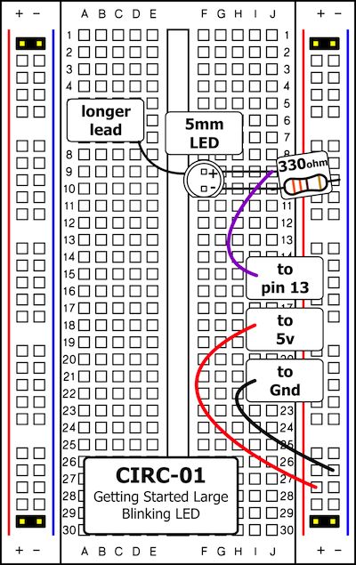
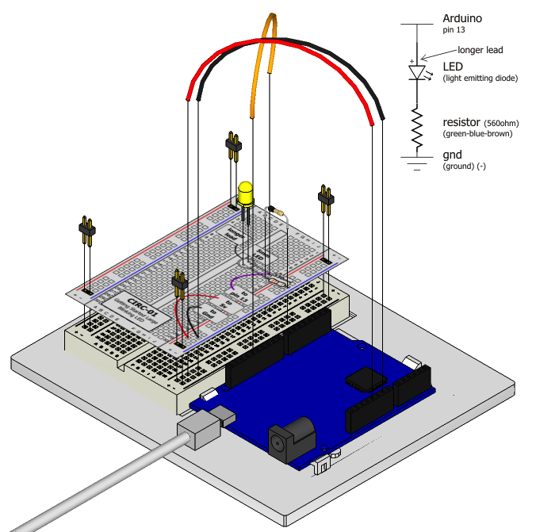

LEDs (light emitting diodes) are used in all sorts of clever things
which is why they are included in the Experimenter's kit. We will start off
with something very simple, turning one on and off, repeatedly,
producing a pleasant blinking effect. 

To get started, grab the parts listed below, pin the circuit layout sheet to your breadboard using the header pins and then plug everything in. 

**Make sure your Arduino is disconnected from the computer whenever you are connecting or disconnecting components.**

Plug the Arduino in, and run the program as follows:

`python3 CIRC01-code-led.py`

## Parts

* 2 pin header x 4
* 5mm LED 
* 330 ohm resistor (orange-orange-brown)
* jumper wires

## Circuit Layout

## Circuit Assembly

Assembly video: http://ardx.org/VIDE01

## Code

You can find this code in `CIRC-01-code-led.py`

	from pymata_aio.pymata3 import PyMata3
	from pymata_aio.constants import Constants
	
	
	def pin_13_flash():
		"""
		Set digital pin 13 as a output and make it turn on
		@return:
		"""
		# instantiate the pymata_core API
		board = PyMata3()
		LED_PIN=13
		# set the pin mode
		board.set_pin_mode(LED_PIN, Constants.OUTPUT)
		board.digital_write(LED_PIN,1)
		board.sleep(1)
		board.digital_write(LED_PIN,0)
		board.sleep(1)
		board.digital_write(LED_PIN,1)
	# wait for 5 seconds to see the LED lit
		board.sleep(3)
	
		# reset the board and exit
		board.shutdown()
	
	
	if __name__ == "__main__":
		pin_13_flash()

## Troubleshooting

### LED Not Lighting Up?

Diodes are polarized - that means they will only work in one direction. Try taking the LED out and rotating it 180 degrees (no need to worry, installing it backwards does no permanent harm).

###  The program reports 'Unable to find Serial Port, Please plug in cable or check cable connections.'

Make sure you have connected the Arduino to the computer via USB.

### Still not working?
Sometimes this happens if PyMATA can't communicate with the Arduino via the USB serial connection. Make sure you have closed the Arduino IDE before you run the program to avoid any conflicts. 

## Extending the Code

### Changing the pin:
The LED is connected to pin 13 but we can use any of the Arduino’s pins. To change it unplug the Arduino, take the wire plugged into pin 13 and move it to a pin of your choice (from 0 - 13) (you can also use analog 0 - 5). Then in the code add a variable to store the pin to make it easier to change e.g. to change it to pin 3 use:

    LED_PIN = 3;

### Control the brightness:
Along with digital (on/off) control the Arduino can control some pins in an analog (brightness) fashion using PWM (more details on this in later circuits). To play around with it change the LED to pin 9 and use the `analog_write` function instead of `digital_write`, like we have in this program:

`python3 CIRC01-code-ledb.py`

## More

For more details on this circuit, see http://ardx.org/CIRC01
