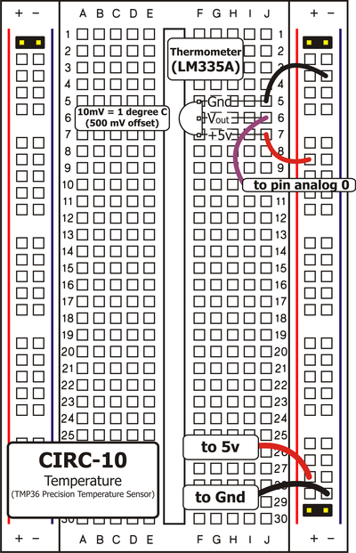
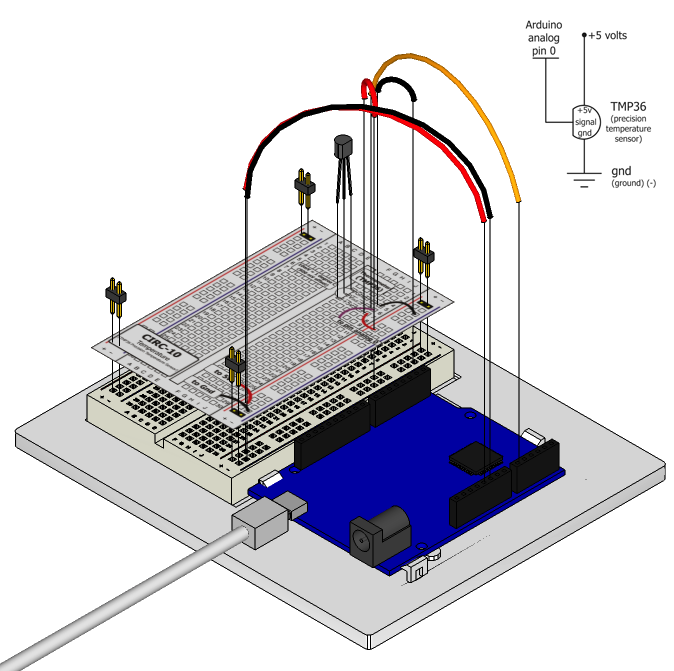

What's the next phenomena we will measure with our
Arduino? Temperature. To do this we'll use a rather
complicated IC (integrated circuit) hidden in a package (TO92)
identical to our P2N2222AG transistors. It has three pins,
ground, signal and +5 volts, and is easy to use. It outputs 10
millivolts per degree centigrade on the signal pin (to allow measuring temperatures below 
freezing there is a 500 mV offset eg. 25° C = 750 mV, 0° C = 500mV). To convert this from
the digital value to degrees, we will use some of the Arduino's math abilities.  We'll output the value to the console. Let's get to it.

The TMP36 Datasheet: http://ardx.org/TMP36

## Parts

* 2 pin header x 4
* TMP36 Temperature sensor
* jumper wires

## Circuit Layout

## Circuit Assembly

Assembly video: http://ardx.org/VIDE10

## Code

You can find this code in `code/CIRC-10-code-temp.py`

	"""
	This example illustrates reading an analog temperature sensor .
	"""
	from pymata_aio.pymata3 import PyMata3
	from pymata_aio.constants import Constants
	# instantiate PyMata with a 2 second start up delay to allow an Uno to complete its reset
	board = PyMata3(2)
	
	TEMP_SENSOR = 0  # temperature sensor is  attached to Analog pin 0
	
	# configure the servo
	board.set_pin_mode(TEMP_SENSOR, Constants.ANALOG)
	for x in range(0, 3):
		# move the servo to 20 degrees
		raw = board.analog_read(TEMP_SENSOR)
		
		print ("raw output voltage =",raw/1024*5,"V")
		#  the arduino returns the voltage as a 10-bit
		# number where 1024 is max voltage (in our case 5v)
		# and 0 is min voltage (Ov)
		
		# NEED TO ADD CONVERSION HERE 
		cel=((raw * 0.4882814) - 50) #TMP36 conversion to Celsius 
		print ("temperature is",cel,"C")
		#print ("temperature is", ((5.0 * raw * 100.0)/1024.0),"C"); # LM35 temp sensor
		board.sleep(3)
	
	# close the interface down cleanly
	board.shutdown()
	

## Troubleshooting

### Nothing Seems to Happen
This program has no outward indication it is working. To see the results you must look at the console output.

### Temperature Value is Unchanging
Try pinching the sensor with your fingers to heat it up or pressing a bag of ice against it to cool it down.

## Extending the Code

### Outputting degrees Fahrenheit:
This is a simple change requiring only algebra. To
convert degrees C to degrees F we use the formula:  

`F = (C * 1.8) + 32`

Add the line:

	fahrenheit = (cel * 1.8) + 32;

## More
For more details on this circuit, see http://ardx.org/CIRC010
