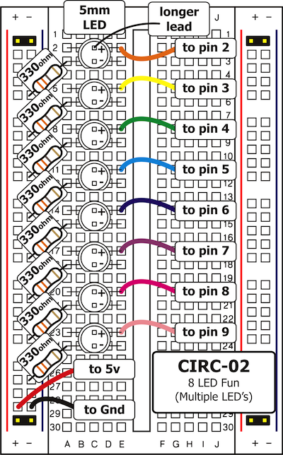
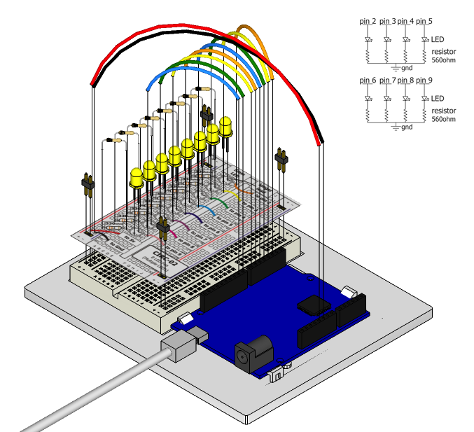

We have caused one LED to blink; now it's time to up the
stakes. Let's connect eight. We'll also have an opportunity to
stretch the Arduino a bit by creating various lighting
sequences. This circuit is also a nice setup to experiment with
writing your own programs and getting a feel for how the Arduino works.

Along with controlling the LEDs we start looking into a few  programming methods to keep your programs small:

 * for loops - used when you want to run a piece of code several times
 * lists - used to make managing variables easier (it's a list of variables)
 * functions - callable blocks of code

## Parts

* 2 pin header x 4
* 5mm LED x 8
* 330 ohm resistor (orange-orange-brown) x 8
* jumper wires

## Circuit Layout

## Circuit Assembly

Assembly video: http://ardx.org/VIDE02

## Code

You can find this code in `code/CIRC02-code-8led.py`

	from pymata_aio.pymata3 import PyMata3
	from pymata_aio.constants import Constants
	def oneAfterAnother():
		"""
		Set digital pins 2 through 8 as a output and make it turn on one at a time
		@return:
		"""
		# instantiate the pymata_core API
		board = PyMata3()
		LED_PINS=[2,3,4,5,6,7,8,9];
		# set the pin mode
		for i in LED_PINS:
			board.set_pin_mode(i, Constants.OUTPUT)
			board.digital_write(i,1)
			board.sleep(0.2)
		for i in LED_PINS:
			board.digital_write(i,0)
			board.sleep(0.2)
		# reset the board and exit
		board.shutdown()
	
	if __name__ == "__main__":
		oneAfterAnother()
	

We use the `LED_PINS` list  store the pins that have LED's attached. We can use for loops to iterate over (i.e. do something for each item in) the collection.

We use the `board.sleep` method to schedule behaviour at certain times. It takes two parameters - the number of seconds to wait, and a function that provides the code to run after waiting for the specified delay.

## Troubleshooting

### Some LEDs Fail to Light
It is easy to insert an LED backwards. Check the LEDs that aren't working and ensure they are the right way around.

###  Operating out of sequence
With eight wires, it's easy to cross a couple. Double check that the first LED is plugged into pin 2 and each pin there after.

### Starting afresh
It's easy to accidentally misplace a wire without noticing. Pulling everything out and starting with a fresh slate is often easier than trying to track down the problem.

## Extending the Code

### Extra animations
Bored of the default animation? Try modifying the timing of the `oneAfterAnother` function, or write your own animation function.

### Confused?
Don't worry! This exercise is about exploring what is possible so there is a lot going on here. We'll take a step back to simpler code for the next couple of exercises.

## More

For more details on this circuit, see http://ardx.org/CIRC02
