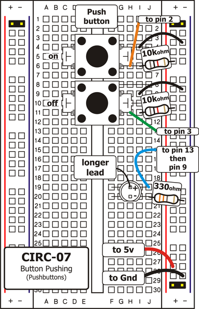
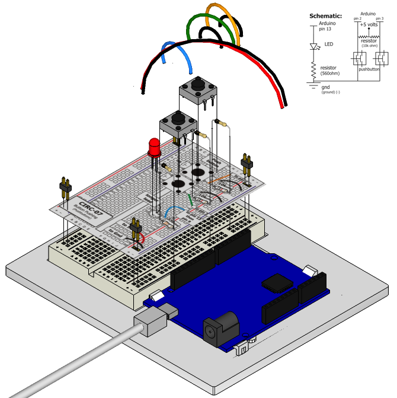

Up to this point we have focused entirely on outputs, time to
get our Arduino to listen, watch and feel. We'll start with a
simple pushbutton. Wiring up the pushbutton is simple. There is
one component, the pull up resistor, that might seem out of place.
This is included because an Arduino doesn't sense the same way we do (ie button pressed, button unpressed). Instead it looks at the voltage on the pin and decides whether it is HIGH or LOW. The button is set up to pull the Arduino's pin LOW when it is pressed, however, when the button is unpressed the voltage of the pin will float (causing occasional errors). To get the Arduino to reliably read the pin as HIGH when the button is unpressed, we add the pull up resistor.

(note: the first example program uses only one of the two buttons)

## Parts

* 2 pin header x 4
* 5mm LED 
* Pushbutton x 2
* 330 ohm resistor (orange-orange-brown)
* 10k Ohm Resistor (brown-black-orange) x 2
* jumper wires

## Circuit Layout

## Circuit Assembly

Assembly video: http://ardx.org/VIDE07

## Code

You can find this code in `code/CIRC-07-code-button.py`

	"""
	This example illustrates manipulating a button motor.
	"""
	
	from pymata_aio.pymata3 import PyMata3
	from pymata_aio.constants import Constants
	# instantiate PyMata with a 2 second start up delay to allow an Uno to complete its reset
	board = PyMata3(2)
	
	LED_PIN = 5  #  led attached to this pin
	BUTTON_PIN = 6
	# configure the servo
	board.set_pin_mode(LED_PIN, Constants.OUTPUT)
	board.set_pin_mode(BUTTON_PIN , Constants.INPUT)
	
	for x in range(0, 10):
		# move the servo to 20 degrees
		val = board.digital_read(BUTTON_PIN )
		if val = 1:
			print("button is pressed ")
		else:
			print("button isn't pressed ")
		board.digital_write(LED_PIN,val)
		board.sleep(0.5)
	
	# close the interface down cleanly
	board.shutdown()
	
	

## Troubleshooting

### Light Not Turning On
The pushbutton is square and because of this it is easy to put it in the wrong way. Rotate it 90 degrees and see if it starts working.

### Underwhelmed?
No worries these circuits are all super stripped down to make playing with the components easy, but once you throw them together the sky is the limit.

## Extending the Code
You can use the latching functions of pymata to capture a button press even when your not looking

## More

For more details on this circuit, see http://ardx.org/CIRC07
