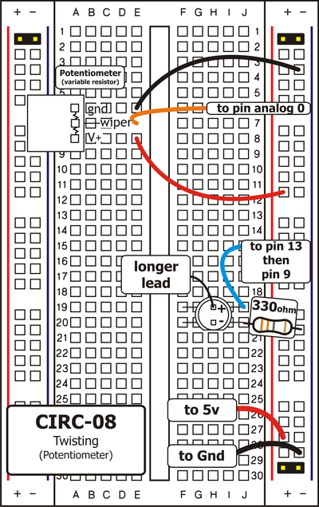
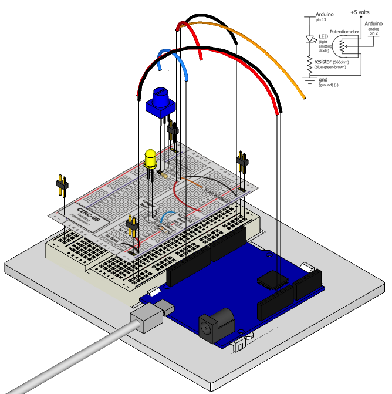

Along with the digital pins, the Arduino also has 6
pins which can be used for analog input. These
inputs take a voltage (from 0 to 5 volts) and convert
it to a digital number between 0 (0 volts) and 1024 (5 volts) (10 bits of resolution). A very useful device that exploits these inputs is a potentiometer (also called a variable resistor). When it is connected with 5 volts across its outer pins the middle pin will read some value between 0 and 5 volts dependent on the angle to which it is turned (ie. 2.5 volts in the middle). We can then use the returned values as a variable in our program.

## Parts

* 2 pin header x 4
* Potentiometer 10k ohm
* 5mm LED
* 330 ohm resistor (orange-orange-brown)
* jumper wires

## Circuit Layout

## Circuit Assembly

Assembly video: http://ardx.org/VIDE08

## Code

You can find this code in `code/CIRC-08-code-pot.py`

	"""
	This example illustrates manipulating a led brightness from a pot.
	"""
	
	from pymata_aio.pymata3 import PyMata3
	from pymata_aio.constants import Constants
	# instantiate PyMata with a 2 second start up delay to allow an Uno to complete its reset
	board = PyMata3(2)
	
	LED_PIN = 9  # LED attached to this pin
	POT_PIN = 0  # potentiometer  attached to A0 ("A" is dropped)
	
	# configure the pins
	board.set_pin_mode(POT_PIN, Constants.ANALOG)
	board.set_pin_mode(LED_PIN, Constants.PWM)
	
	for x in range(0, 3):
		# read the pot and  output it's value to the led 
		var = (board.analog_read(POT_PIN))
		board.analog_write(LED_PIN, int(var/4))
		print ("pot value is " ,var)
		board.sleep(3)
	
	# close the interface down cleanly
	board.shutdown()
	

## Troubleshooting

### Sporadically Working
This is most likely due to a slightly dodgy connection with the potentiometer's pins. This can usually be conquered by taping the potentiometer down.

### Not Working
Make sure you haven't accidentally connected the potentiometer's wiper to digital pin 0 rather than analog pin 0 (the row of pins beneath the power pins)

### Still Backward
You can try operating the circuit upside down. Sometimes this helps.

## Extending the Code

### Threshold switching

Sometimes you will want to switch an output when a value exceeds a certain threshold. To do this with a potentiometer, add a variable for the threshold value to your program (e.g. `var threshold = 512;`) and change the code in the "data" handler to:
    board.set_pin_mode(LED_PIN, Constants.OUTPUT)
	...
	if var > threshold:
       board.digital_write(LED_PIN,1)
	else:
	   board.digital_write(LED_PIN,0)

### Controlling a servo:
This is a really neat example and brings a couple of circuits together. Wire up the servo like you did in [Exercise 4](/exercises/4), then modify the code to set the position of the servo based on the value of the pot note you may need to scale the range of the pot to the servo

Run your program and then watch as the servo shaft turns as you turn the potentiometer.

## More

For more details on this circuit, see http://ardx.org/CIRC08
